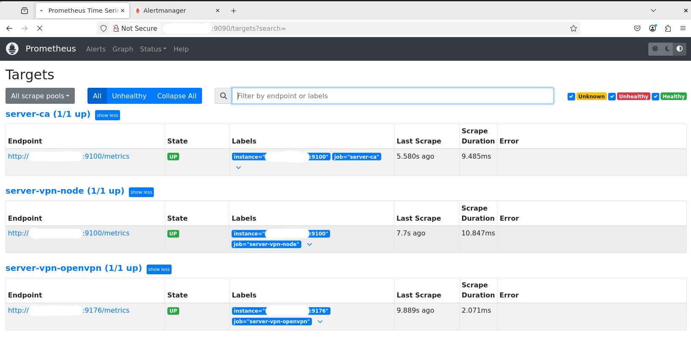

# Prometheus Monitoring Stack
Cистема мониторинга и алертинга на базе Prometheus.
Что реализовано
- Сбор метрик с серверов через Node Exporter
- Мониторинг сервисов (Prometheus targets)
- Алертинг через Alertmanager
- Уведомления:
  - Email (SMTP Gmail)
  - Telegram (через webhook + bot)
- Безопасность:
  - Firewall (iptables)
  
# Архитектура
[Node Exporter] → [Prometheus] → [Alertmanager] → [Telegram / Email]
## 📊 Monitoring

### Prometheus Targets

### Telegram Notification

### Email Notification

